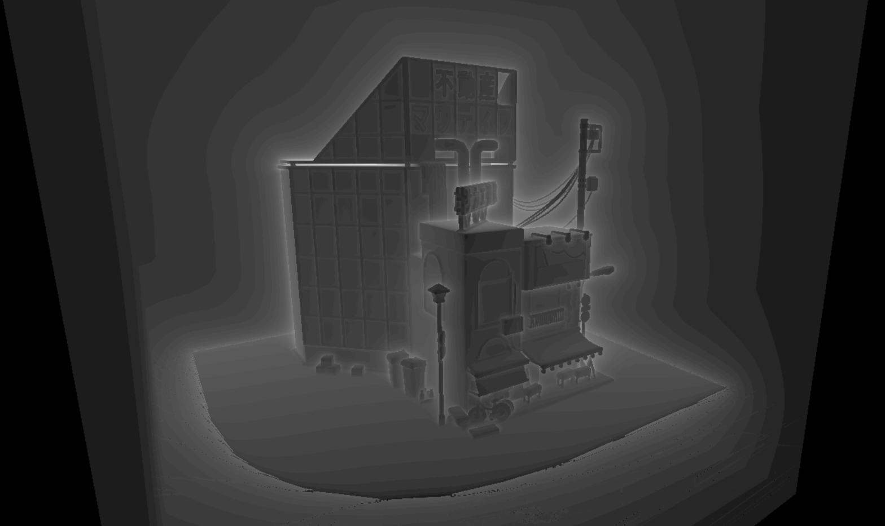
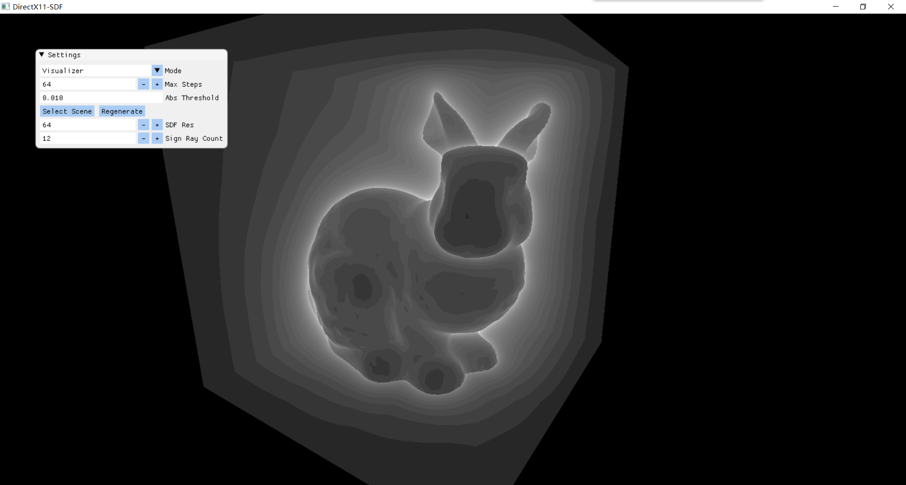

## GPU SDF Generator

Fast 3D signed distance field generator written with DirectX 11 compute shader



### Building

 ```power
 git clone --recursive https://github.com/AirGuanZ/SDFGenerator.git
 cd SDFGenerator
 mkdir build
 cd build
 cmake ..
 ```

### Options

```cmake
OPTION(D3D11SDF_BUILD_SAMPLE "build SDF sample"   ON)
OPTION(D3D11SDF_BUILD_CLI    "build SDF cli tool" ON)
```

### Usage

```powersh
./SDF-CLI.exe -i "./mesh.obj" -o "./output.txt" -r 128,128,128 -q 16 -s -50,-50,-50 -l 50,50,50 -g true
```

* `-i` Input mesh filename (.obj, .stl, .ply)
* `-o` Output text filename
* `-s` Min point in SDF bounding box. format: `x,y,z`, or a single floating point value specifying all of them
* `-l` Max point in SDF bounding box. format: `x,y,z`, or a single floating point value specifying all of them
* `-g` (Optional) Use gpu or not. default value is `true`
* `-r` (Optional) SDF resolution. format: `width,height,depth`, or a single integer specifying all of them. default value is `64`
* `-q` (Optional) Quality. number of rays for determining value sign. default value is `12`

### Output format

SDF-CLI write generated SDF values into a text file with following pseudocode:

```
file.write(width)  file.write(" ")
file.write(height) file.write(" ")
file.write(depth)  file.write(" ")
for z in [0, depth):
	for y in [0, height):
		for x in [0, width):
			file.write(SDF[x][y][z])
			file.write(" ")
```

### SDF-Sample

A demo program using ray marching to visualize generated SDF.

